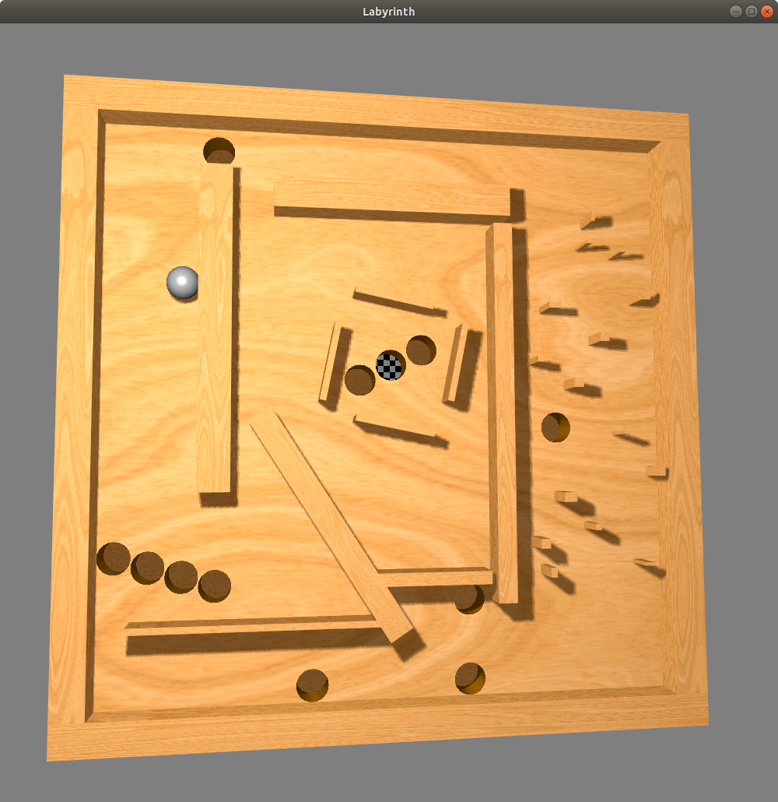

# Assignment 4: Final Project - Marble Labyrinth Board

CSCI-GA 2270 - Computer Graphcs - Fall 18, NYU COURANT

## How to play

Move cursor to tilt the board and guide the marble to go around obstacles and reach the goal (the hole marked with checkerboard pattern). Press ENTER to reset the position of the marble. Press W, A, S or D to change camera postion. Press Q or E to change camera distance.

## Technique used in the program

### Texture mapping
The game board is textured in wood material. Only one wood texture image is used. To avoid repeating pattern, each block uses a different part of the texture image, whose texture coordinates are generated in a pseudo-random way.

### Shadow mapping
To make it more realistic, shadows are rendered using shadow mapping: The entire scene is rendered using the light source as the camera position and the z-buffer is saved to a texture. Then the scene is rendered again from the real camera postion. Each fragment computes its distance to the light source, and compares with the closest distance to the light source on the same light ray, which is stored in the previously saved z-buffer, to determine whether the fragment is in the shadow.

### Geometry generated by shader

Given that the scene only contains simple geometry, the program uses attributeless rendering to simplify the modeling step. For a box, vertex coordinates and other attributes are generated in the vertex shader according to the vertex index. Sphere and cylinders are also generated as a bounding box in the vertex shader, and in the fragment shader, a local ray-tracing method is performed: rays are casted and the intersection test is done with the sphere/cylinder, to determine whether to discard the fragment or not, and to determine the actual intersection coordinates and the normal. The fragment depth is also modified accordingly so that proper z test can be performed and the shadow map can be correctly generated.

### Drawing holes using stencil buffer
The holes on the board are first rendered as disks (in a similar way of ray-tracing, but in 2D). This rendering step doesn't output any color, but marks on the stencil buffer. Then The main board is drawn with stencil test enabled, where the fragments that were previously marked in the stencil buffer are discarded. The bottom of a hole is drawn as a normal disk, and the wall is drawn as a cylinder.

### Game physics

The program uses the 2D inelastic collision model. A simple force is applied to the marble, which physically represents the net force of the gravity and the support from the main board. When a collision between marble and a block is detected, the velocity in the direction normal to the collision plane is cancelled. If there are two collisions from different blocks, the marble is set fully stopped.

The animation of the marble falling into a hole is an approximation rather than physical similation. If the coordinates of the marble goes into the range of a hole, the program immediately determines that it will fall into it, which is not very accurate as in reality a marble with very high speed can "jump" over the edge of a hole. In this program, once falling is decided, the normal phyiscal simulation routine is disabled, and an animation of marble falling in a spiral path is played. The spiral path is determined by the velocity (augular and radial) when the marble goes in the hole region.
